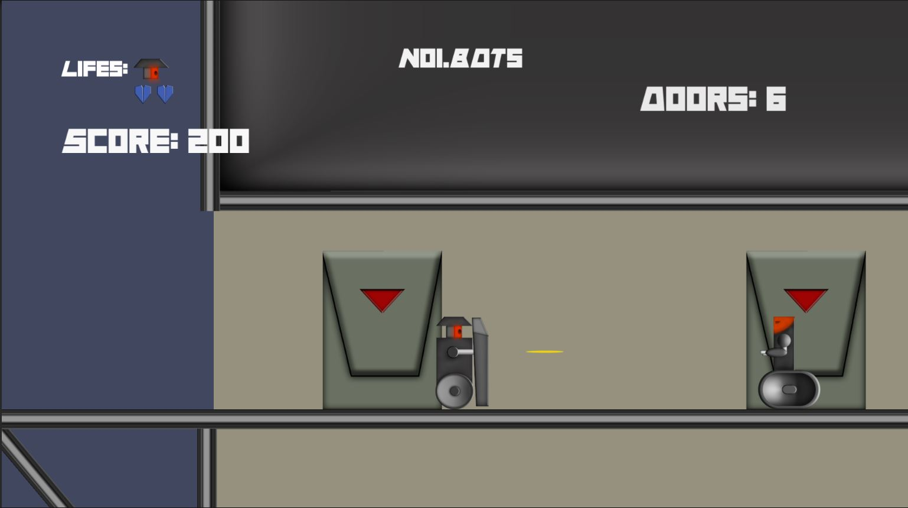

# N01.BOTs Prototype Project

  

This is my first prototype game made using Unity and C#, which I created as a study project while I was learning game development. 

<b>NOTE: Only available has a portfolio game and isn't recommended to be played has a complete game.</b>

Developed: 2016.

The game had a big influence on the retro game "Elevator Action" with some extra mechanics. At this point is very amateur and had some bugs, but I'm very proud this was my first attempt facing Unity to make a game alone.

<b>[Itch.io build link](https://deadlysmile.itch.io/n01bots)</b>

---

### Features:
- <b>Fully inspired on the original Elevator Action from 1983 by Taito.</b>
- <b>Dinamyc aim and shield for a more action oriented gameplay.</b>
- <b>2 complete levels and a final boss</b>
- <b>On every level the amount of target doors and what door is activated is completely RNG</b>

---

### Changelog

- #### v0.2:
  - Updated Unity engine from 5.4 to 2021.3.
  - Little UI optimization.
  - Translated to english (originally was full spanish).
  - Added music by Dark Fantasy Studio.
- #### v0.1:
  - Initial version maded on 2016.
